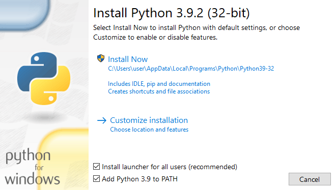
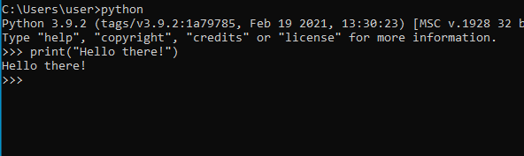
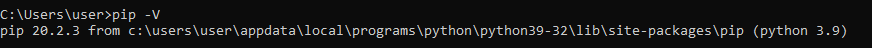
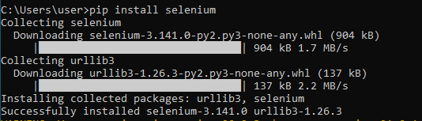

# Instagram bot
Python script that emulates a human on Instagram. This bot watches the stories and likes the posts of the users specified.


## Installation
+ Install python3
+ Install selenium
+ Download the repo or the App folder
+ Modify preferences.py inside Main
  + Write the username to log into your Instagram account.
  + Write the password to log into your Instagram account.
  + Setting the right driver for the browser you wanna use.
  + Change other settings if you want (see later section)
+ Run main.py as a python script.

### Installing Python and selenium
#### Python
Python comes preinstalled in Linux and Mac. If for some reason you have python 2, you should install python 3. Try to follow [this guide](https://phoenixnap.com/kb/how-to-install-python-3-ubuntu) for Linux and [this guide](https://www.saintlad.com/install-python-3-on-mac/) for Mac.

On Windows, go to the [download page](https://www.python.org/downloads/) of python and download the windows installer (x32 or x64 depending on your computer). Run the installer and make sure that on that "Add python to PATH" is selected.



Then click "Install now". At the end, click on "Disable path length limit". Python is installed. To check that everything has gone well just open cmd and run the command `python` then it will prompt with a >>> where you can insert python code, like in the image:



#### Selenium
There are multiple ways of installing selenium, in this section i will use pip. pip may come preinstalled so check if you have installed pip using the command `pip3 -V` or `pip -V`.



If it isn't installed, on Linux for most of the distros the command `sudo apt install python3-pip` should work, otherwise follow [this guide](https://linuxconfig.org/install-pip-on-linux). For Mac, try to follow [this guide](https://www.geeksforgeeks.org/how-to-install-pip-in-macos/). For Windows, [this guide](https://www.liquidweb.com/kb/install-pip-windows/).

Once pip is installed just run the command `pip3 install selenium` or `pip install selenium`.



### Adjusting the preferences
These are the default preferences:
```python
self.hours_of_sleep = 0
self.read_file_path = ""
self.accounts_hard_coded = ("kurzgesagt", "nasa", "wikipedia")
self.number_of_processes = 2
self.number_of_posts = 3
self.username = ""
self.password = ""
self.rest_time = 5
self.driver_function = drivers["Firefox"]["function"]
self.driver_string = drivers["Firefox"]["string"]
```
In order for the bot to work properly, you must specify a username (or mail) and a password. It will log in with the username and password given and it will like the post and watch the stories using that account. Once done, the username and password should look something like this:
```python
self.username = "fakemail@fakemail.com"
self.password = "mybeautifulpassword"
```
#### Changing the browser
There are two browser you can easily choose: Firefox and Chrome. If you choose Firefox the two lines about the driver should be:
```python
self.driver_function = drivers["Firefox"]["function"]
self.driver_string = drivers["Firefox"]["string"]
```
If you choose Chrome, the two lines about the driver should be:
```python
self.driver_function = drivers["Chrome"]["function"]
self.driver_string = drivers["Chrome"]["string"]
```

If you want to use other browser, you need to find the function to invoke to start the browser and the driver to pass as an argument.

Once you have chosen your browser, you need to download the relative driver. For Firefox is [geckodriver](https://github.com/mozilla/geckodriver/releases) and for Chrome is [ChromeDriver](https://chromedriver.chromium.org/downloads). Download it and place it inside the folder Main in App.

In order to work properly, your browser should have as a language English. Different languages could make the code work only partially (for example the liking process will not like the posts).
#### Changing the accounts
The element that you probably wanna change is the list of usernames to use during execution. You must specify the actual username, not the name or other information about the account. There are two ways to specify the list: the text file and explicitly saying the accounts to use.

To use the text file, just write a text file that contains for each row only one username. Save the file and add the relative path of the file in `self.read_file_path`. For example, create a text file named *accounts.txt* and put it inside the Main folder, then you should change the preferences in this way:
```python
self.read_file_path = "accounts.txt"
```

To specify the accounts explicitly, `self.read_file_path` must be an empty string (`self.read_file_path = ""`), then just type the usernames inside the parenthesis, each user should be written inside the double quotes symbol and separated from the others with comma. Example of this are:
```python
# Example 1
self.accounts_hard_coded = ("somebody", "somebodyelse")
# Example 2
self.accounts_hard_coded = ("username1", "username2", "username3", "username4", "username5", "username6", "username7")
```
#### Multi-threading or multi-processing?
The code runs the bots concurrently. If you don't want to use your computer too much during the execution, just set the number of processes to 1: `self.number_of_processes = 1`. If you wanna use more processes, you can change the number as you like.

The bot runs concurrently for a functional requisite, but you can easily switch back and forth from multi-processing to multi-threading. To do that, change the function `stories_and_posts_all` in *processor.py* inside Processor. For multi-processing the line should be:
```python
with concurrent.futures.ProcessPoolExecutor() as executor:
    executor.map(stories_and_posts_group, tasks_collection)
```
For multi-threading the line should be:
```python
with concurrent.futures.ThreadPoolExecutor() as executor:
    executor.map(stories_and_posts_group, tasks_collection)
```
#### Other preferences
The hours of sleep are the hours that the script is going to wait before starting the execution. It has a default of 0, so it will run immediately.

The number of posts are the maximum number of posts that the bot will like per each user.

The rest time is the time that the bot will wait after doing some action on the browser. A slower internet connection requires an higher rest time to execute the script properly.
### Running the code
Using the terminal or cmd (for windows), go to the folder where you have downloaded the repo and then go inside App and inside Main. Run *main.py* with `python3 main.py` or `python main.py`.
#### The log file
When you run the code, it will write any relevant information on a log file (named by the day it has been run): for each user, there will be a line following the pattern: `User: story_state, post_state`. For example, it could be *kurzgesagt: watched the stories, liked the posts*. It will also write errors that have occurred.
## Usage example
The example at the beginning of this file shows the code working for Firefox in Linux.

Here's an example working for Chrome in Windows:


## What's the description for?
If you decide to fork this repo or develop your own version, the description will help you clearly see the dependencies between classes and packages so it's easier to write cleaner code.
## Meta
Distributed under the GNU license. See ``LICENSE`` for more information.

[My github account](https://github.com/vetsen/)
